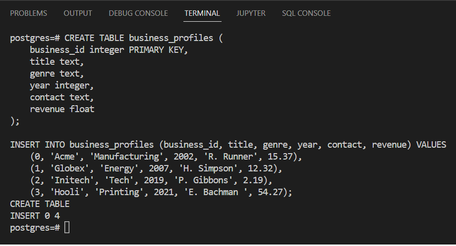
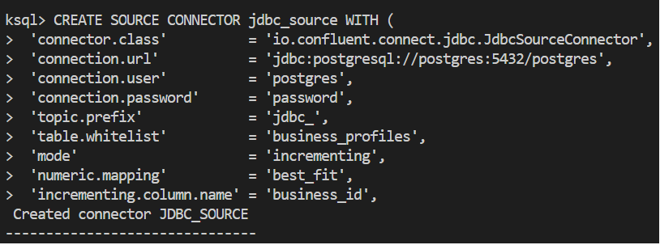
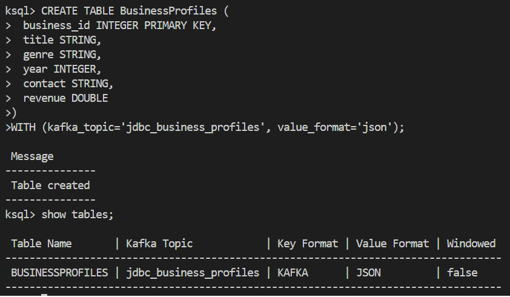
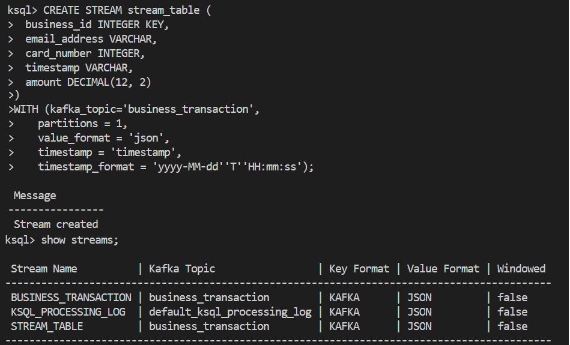
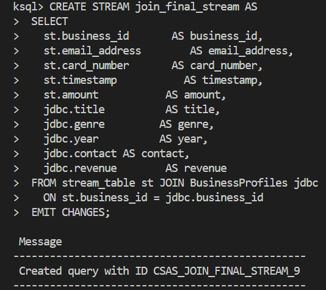

# How to build connection between ksqlDB and postgreSQL JDBC

This is how to connect ksqlDB to postgreSQL using JDBC connector

## Set-up docker-compose.yml

We will using this [docker-compose.yml](docker-compose.yml)

### Download JDBC connector

Download the zip file from [Confluent kafka-connect-JDBC](https://www.confluent.io/hub/confluentinc/kafka-connect-jdbc), and extract it into the same directory with the docker-compose.yml file.

```
Note : The unzipped file may have the version appended to it, such as confluentinc-kafka-connect-jdbc-10.2.4. This needs to be renamed to confluentinc-kafka-connect-jdbc.
```

Now that the docker-compose.yml file is locally available, download the Docker images.

```
docker-compose pull
```

Now that your chosen configuration is set up, bring up the deployment.

```
docker-compose up
```
There are should now several containers running and we are going to interact with two of those containers directly (postgres and ksqldb-cli)

## Create PostgreSQL Table

Open up new terminal and write
```
docker exec -it postgres psql -U postgres
```

This will bring us to a postgres prompt. Run the following in the postgres prompt:

```
CREATE TABLE business_profiles (
    business_id integer PRIMARY KEY,
    title text,
    genre text,
    year integer,
    contact text,
    revenue float
);

INSERT INTO business_profiles (business_id, title, genre, year, contact, revenue) VALUES
    (0, 'Acme', 'Manufacturing', 2002, 'R. Runner', 15.37),
    (1, 'Globex', 'Energy', 2007, 'H. Simpson', 12.32),
    (2, 'Initech', 'Tech', 2019, 'P. Gibbons', 2.19),
    (3, 'Hooli', 'Printing', 2021, 'E. Bachman ', 54.27);

```
The result should show :



## Create JDBC connection in kSQL

To connect kSQL with PostgreSQL, we need to run the kSQL client container command. Run the following via the command line in a new terminal window.

```
docker exec -it ksqldb-cli ksql http://ksqldb-server:8088
```

This will bring us to a ksql prompt. Now we want to have SOURCE CONNECTOR that allows us to access the PostgreSQL data. Run the following in the ksql prompt.

```
CREATE SOURCE CONNECTOR jdbc_source WITH (
  'connector.class'          = 'io.confluent.connect.jdbc.JdbcSourceConnector',
  'connection.url'           = 'jdbc:postgresql://postgres:5432/postgres',
  'connection.user'          = 'postgres',
  'connection.password'      = 'password',
  'topic.prefix'             = 'jdbc_',
  'table.whitelist'          = 'business_profiles',
  'mode'                     = 'incrementing',
  'numeric.mapping'          = 'best_fit',
  'incrementing.column.name' = 'business_id',
  'key'                      = 'business_id',
  'key.converter'            = 'org.apache.kafka.connect.converters.IntegerConverter');
  ```

The result should show :



  ## Create ksql table based on jdbc table

  Write this to create ksql table so it can stream topic

  ```
CREATE TABLE BusinessProfiles (
  business_id INTEGER PRIMARY KEY,
  title STRING,
  genre STRING,
  year INTEGER,
  contact STRING,
  revenue DOUBLE
)
WITH (kafka_topic='jdbc_business_profiles', value_format='json');
```
The result should show :



## Create stream_table

Now, the table exist we need to make a stream that will be used for every time we interact with that table. Run the following in the ksql prompt.

```
CREATE STREAM stream_table (
  business_id INTEGER KEY,
  email_address VARCHAR,
  card_number INTEGER,
  timestamp VARCHAR,
  amount DECIMAL(12, 2)
)
WITH (kafka_topic='business_transaction',
    partitions = 1,
    value_format = 'json',
    timestamp = 'timestamp',
    timestamp_format = 'yyyy-MM-dd''T''HH:mm:ss');
```

The result should show :



## Create join stream


To add information from the prior PostgreSQL database to the table we are working with we can JOIN the stream with the information in the topic. Run the following in the ksql prompt.
```
CREATE STREAM enriched_business_transaction AS
  SELECT
    bt.business_id      AS business_id,
    bt.email_address    AS email_address,
    bt.card_number      AS card_number,
    bt.timestamp        AS timestamp,
    bt.amount           AS amount,
    jdbc.title          AS title,
    jdbc.genre          AS genre,
    jdbc.year           AS year,
    jdbc.contact        AS contact,
    jdbc.revenue        AS revenue
  
  FROM business_transaction bt JOIN BusinessProfiles jdbc
    
        ON bt.business_id = jdbc.business_id
  
  EMIT CHANGES;
  ```

The result should show :


